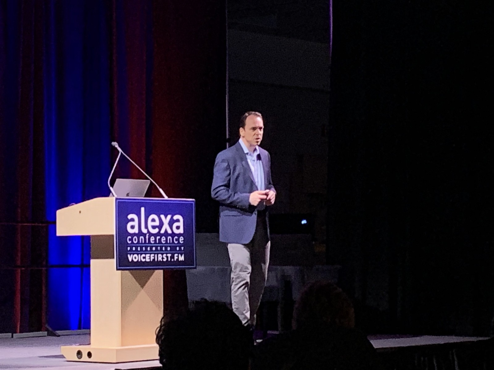
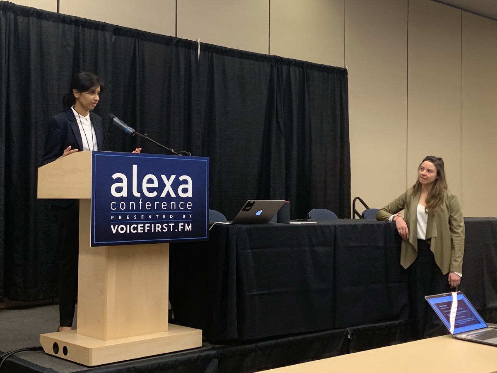
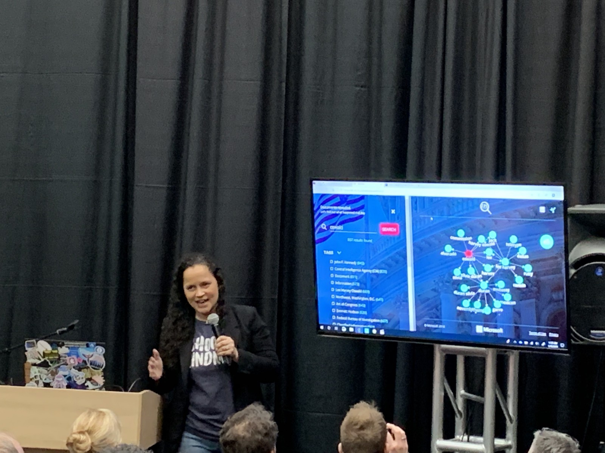
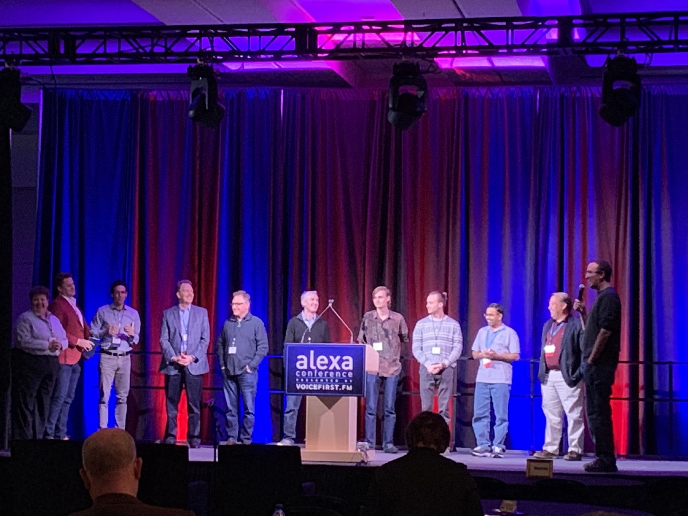
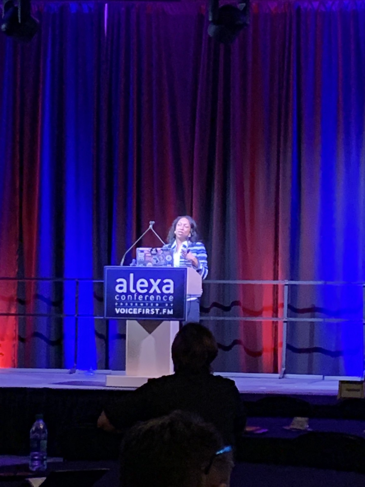
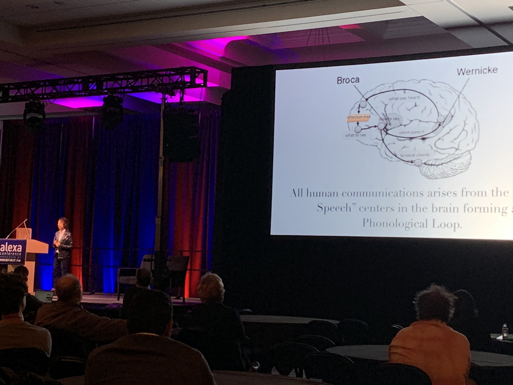
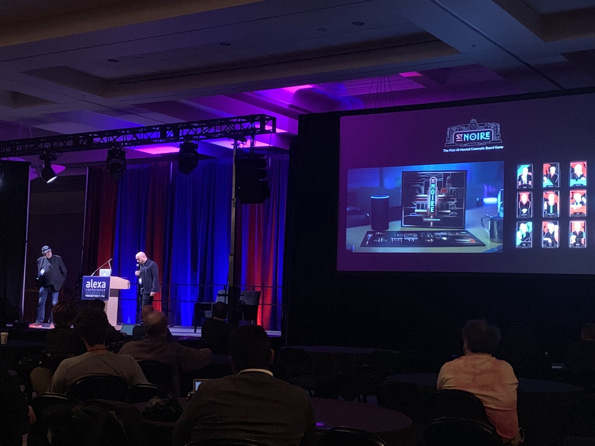

I was incredibly fortunate to attend Alexa Conference 2019 in Chattanooga, Tennessee this past week. It was fascinating to see so many people in one place who are all as excited as I am about the potential of voice and conversational assistants. It would have been impossible to see all the great talks that were given, but I wanted to record my own experience and thoughts on this event.

Bret Kinsella of voicebot.ai kicked off the conference with a slew of research and statistics showing the astounding rise of voice. Smart speakers are the fastest growing consumer technology of all time, reaching nearly 50% adoption by some estimates in the U.S. in less than five years. Voice assistants are also popular among older users, who tend to be wary of new technology or have difficulty using it. But the assistive nature of voice seems to be reversing this dynamic, making Alexa an attractive option for users of all ages. As Bret explained, we’ve reached a point where two major players, Amazon and Google, will be difficult to overtake especially in English-speaking markets. But globally there’s still much to be seen. Amazon in particular has a lot of work ahead to support other languages, and Chinese juggernauts Baidu, Alibaba and Tencent all have virtual assistants that are rapidly gaining domestic adoption.

Bret Kinsella of voicebot.ai shared the latest trends and forecasts for voice technology.

### Differentiation Through Personality
Bret explained that we are now in a second phase of the voice assistant market, as evidenced by adoption, competition in the space and the integration of voice tech into existing products. With over 50,000 skills in the Alexa ecosystem, developers need to differentiate their offerings. Several presenters focused on communicating personality through voice to make brand experiences more memorable.

In one session, Neha Javalagi and Brielle Nickoloff of WitLingo explained common voice user experience pitfalls through the analogy of being on a first date with the user. This is a useful shorthand because you only get one chance to make a good first impression, which determines whether you’ll get a second date. For example, they explained that skills should respond with brevity while giving the user some guidance on what they can say. And just like in a real conversation, skills should try to rephrase and reprompt to handle errors instead of simply apologizing, and implicitly confirm the user’s request while delivering a response.

Neha Javalagi and Brielle Nickoloff roleplayed an interaction to show the importance of creating positive first impressions.

Emily Binder of Beetle Moment Marketing, echoed this sentiment in another session, focusing on the importance of thinking about a brand’s unique sound. She gave one example of a skill featuring an old Southern barbeque master who explains how to smoke meats. His sometimes hard-to-understand dialect was clarified by Alexa herself, resulting in a memorable banter between the two. But in addition to all the creative possibilities of voice, Emily emphasized that developers should always find ways to add value for their users.

Ben Fisher of Magic & Co. pointed to a major shift in the marketing industry which voice tech is pushing forward. He told us that marketing campaigns are like a sugar rush: they spark interest for a brief period, but the benefits in consumer awareness don’t last. In comparison with a marketing campaign, an Alexa skill is cheap to build, and allows marketers to engage their targets in more interactive and potentially long-term ways. Because of this, he thinks skills will force marketers to be less content-driven, and more product-driven. While I don’t think this trend will spell the end of content marketing by any means, it’ll be exciting to see how new content becomes more interactive and productized as voice continues to be adopted. And let’s not forget that conversational assistants can be a great way of allowing existing content to be effectively used long after it’s created.

### Differentiation Through Depth
As important as marketing and branding is in the voice space, it’s equally important to think about how voice services can solve challenging domain-specific problems. A great example came from Dr. Sandhya Pruthi of the Mayo Clinic, who presented a skill that provides on-demand first aid assistance. Content is organized by topic, which allows the skill to provide relevant information to users based on their request. Her group made use of existing web content by shortening that content significantly to make it appropriate for voice.

Noelle LaCharite of Microsoft showed off the analytics capabilities of Azure. She demoed how you can ingest data — in her example, tens of thousands of documents about the JFK assassination — into the cloud. The result was a dashboard with a searchable knowledge graph. She then showed off HooverBot, a chatbot which provided facts and documents related to the user’s request. Extrapolating real recordings of J. Edgar Hoover, the bot’s synthesized voice sounded very much like the FBI chief.

Noelle LaCharite shared the analytic and conversational capabilities of Azure.

With the possibilities of conversational assistants beginning to mature in a variety of domains, there remains the question of how to make sure users get the most out of what’s available. Katie McMahon of SoundHound presented the capabilities of the Hound platform, which includes being able to parse complex requests which would normally be difficult for an assistant to understand. But she went on to explain that despite the power of this functionality, users often don’t discover it. The result is an apparent paradox: Users don’t know about the exceptional experience, and they’re conditioned to expect the opposite, so they don’t try to interact with the assistant in a truly conversational way.

Using conversational assistants to access deep knowledge domains is a problem I’m particularly interested in. If you want to build a skill that’s an expert at something, you end up running into the same kinds of problems: It’s challenging to represent knowledge and content, connect a user request with something that’s useful, and provide interactive dialogs that feel like a conversation. As the developer of the Smash Aid skill, I’m wrestling with these problems, too. I discussed some of the lessons I’ve learned so far in a talk which can be found [here](https://www.youtube.com/watch?v=oAmobFK09pU).

### Technology and Tooling
Amazon’s own Paul Cutsinger gave an overview of what’s new in the Alexa ecosystem, pointing out that it’s easy for devs to miss new features and tools once they have a way of doing things. A few highlights were the Alexa Skills Kit Command Line Interface (ASK CLI) and the numerous options for monetization in skills, including Amazon Pay, one-time purchase, subscriptions and consumables.

I particularly appreciated several sessions that focused on development tips and best practices. Emerson Sklar of Applause honed in on a few common issues. As skills get more complex, intent recognition gets harder, and small changes to the interaction model can lead to drastic user experience changes. Further, a failed voice experience can negatively impact brand perception. All this requires developers to be creative in solving recognition problems and perform comprehensive testing, including dialog verification, functional testing and exploratory feedback. Shanthan Kesharaju of Sermo Labs stressed the importance of taking advantage of AWS infrastructure, such as building fast, responsive lambda functions and making use of Cloudwatch for monitoring and alerts. Finally, Tahsim Ahmed reviewed several visual development tools for building skills without code. This is a great option for creators who are less technical, want to take a higher level approach or don’t want to double their effort to support other platforms such as Google Assistant.

The judges and participants of the startup battle participants gather on the stage. Left to right: Judy Mod (Innovations Domain), Patrick Givens (VaynerMedia), Rodrigo Prudencio (Alexa Fund), presenters from #250, SonicCloud, Virtual Concierge Service, Voice First Tech, ConverSight.AI, event organizer Bradley Metrock.

The Alexa Conference even featured a startup battle: Five companies were given five minutes each to give their pitch. Each startup had a compelling angle, but in the end the award went to SonicCloud. Their app improves users’ hearing by amplifying sound based on a pitch-specific “Hearing Fingerprint.” Apparently a big improvement over hearing aids, it feels like one of those things that’s obvious in retrospect — often the mark of a breakout technology.

### Storytelling and The Voice Community
The event was keynoted by Kesha Williams of Chick-Fil-A, who spoke about how Alexa helped her to find her own voice. Frustrated by years in management, she got back in touch with her love for technology when she created Live, Plan, Eat, a time-saving Alexa skill for meal planning. Kesha acknowledged the challenges that women and minorities face due to bias in tech, but insisted that we can improve these conditions by setting an example for others and spreading awareness of what’s possible to achieve.

Kesha Williams describes how she reflects on her own past successes to overcome self-doubt.

For me, this message of inclusivity and humanizing technology was fitting for the voice community in particular. Unlike many technology conferences, which are largely populated by developers and technology vendors, The Alexa Conference was equally filled with marketers, storytellers, and business people from manifold industries who were just trying to wrap their heads around how they could use this disruptive, yet uncommonly intuitive technology to create value. And it’s that very intuitiveness that makes voice different: It’s really a way of getting technology out of the way, so we can more easily reach its benefits.

In a memorable talk, Brian Roemmele used anthropological evidence to point out that language is humanity’s “first interface.” Not only is it how we first interact with others and begin to think, but it’s what allowed the human species to separate from the others, reason about the past and future and record our own stories for future generations. Brian drew a connection from our species’ origins to something beginning to happen today: We are using language to make technology more human. Brian challenged his audience to consider the possibilities of a virtual assistant that securely stores all of one’s experiences and wisdom, and uses it to assist and advise future generations. He argued that this tool would be the most human of technologies — “the last interface.”

Brian Roemmele explains the connection between language and thought.

This is perhaps a bit out there, but then again technology is all about trying to see into the future. If you accept the premise that storytelling is fundamental to what people have always done, something along the lines of Brian’s “YourWisdomKeeper” and “TheIntelligenceAmplifier” is probably inevitable. I hope that it can be built in a way that maintains the privacy and security of this very personal data.

But until we get there, we can expect that voice assistants will be a rich new way of telling stories. Nolan Bushnell and Zai Ortiz presented what’s coming from their collaboration X2 Games, which uses Alexa to create interactive movie and game experiences. Their upcoming murder mystery board game, St. Noire, is like a multimedia version of Clue put together by a movie studio design team. As Bushnell put it, we can look forward to “new things, weird things.”

Nolan Bushnell and Zai Ortiz describe St. Noire.

I was ecstatic to be a part of The Alexa Conference, and I look forward to watching this technology and community grow!