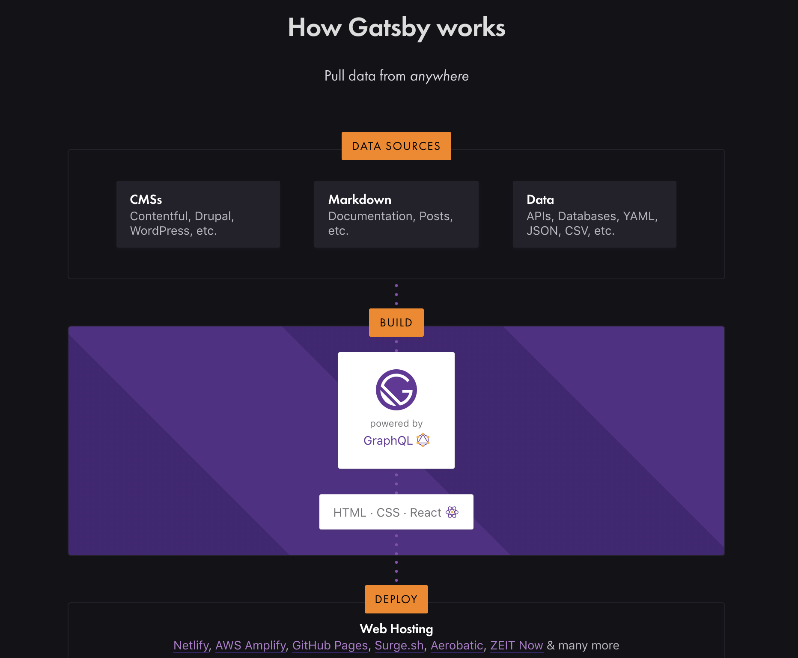
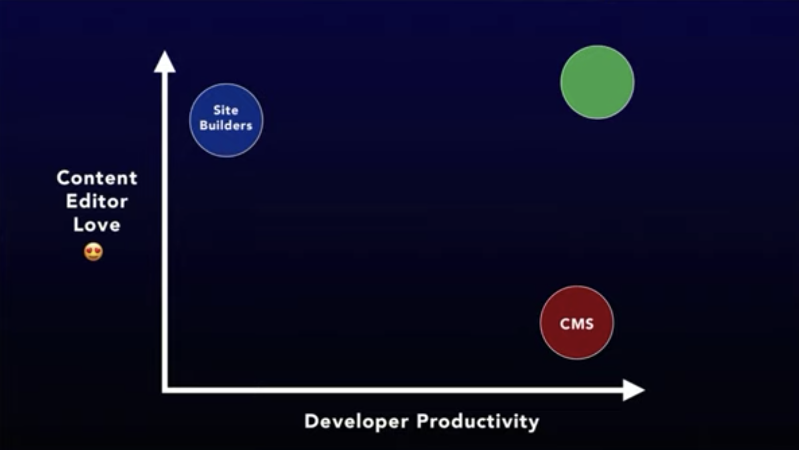

Gatsby combines the flexibility of React, and the data retrieval paradigm of GraphQL with the convenience of writing Markdown and pushing it to GitHub.
 

Building a website is surprisingly hard.

As a developer, I tend to scoff at the idea of using a popular tool like Wix or Squarespace. I can build it myself, and I'll have so much more control!

My background's in mobile, not frontend development, so my first real foray into building a full website was only a few years ago.

I was getting married. Naturally, I took responsibility for building our wedding website.

It turned out to be a bit trickier than I expected. I'll spare you the details, but I gained a newfound respect for how complex, powerful and occasionally bewildering CSS can be.

I've learned a bit more about frontend development since then. I love how React lets you combine the best parts of JavaScript and HTML and you modularize the result, and how it handles the complexity of rendering optimization. I also discovered [Gatsby](https://www.gatsbyjs.org), which makes it easy to work with all sorts of data types and resources with a GraphQL querying layer.

Before Gatsby, I learned that you can create a GitHub-hosted blog using another tool called Jekyll. It's amazing because you can customize the site's pages and templates as needed, and simply write your blog posts in Markdown. Push a new Markdown file to the repository, and you just published a new blog post!

Gatsby elevates this story by letting you use React to build your UI. Its integration with GraphQL lets you pull in text from Markdown. And you can use the same querying interface to pull in data and resources, whether it's from local files or remote APIs.

The set of tools for building static sites that are also interactive and dynamic has become known as the [JAMStack](https://jamstack.org). With JavaScript, APIs and Markdown, you can build a modern, lightning-fast site that lives entirely in the browser.

And then there's [Forestry](https://forestry.io): A UI layer for content creators that makes all this Markdown editing feel like it's happening in a real CMS, similar to writing content in WordPress.

Yet even with all this, there's a huge chasm between what we can hack together as developers and what you can do with Squarespace or Wix. There's no guarantee that it'll look good. And you can't edit stuff in place and see what it feels like. If you're a designer, or you're just attempting to think like one, it's helpful to see what content looks like in real time.

Site builders and customizeable CMSs both have tradeoffs that make it hard to build a site that's both beautiful and interactive.
 

In a [recent talk](https://tinacms.org/blog/announcing-tinacms), Forestry CEO Scott Gallant used the above diagram to show how the Gatsby/Forestry solution can be frustrating for both developers and content creators. As powerful as a code-friendly CMS is for developer productivity, developers need help creating a beautiful design. And creators are likely to struggle with editing code. This makes the Gatsby/Forestry solution a bit frustrating for both developers and content creators. Gallant announced TinaCMS, a new product that attempts to deliver the best of both worlds.

For now, we're still in this awkward position where it feels like building a website is more difficult than it should be. There are probably lot of people who aren't professional web developers but nevertheless want to go a level deeper than what simple drag-and-drop tools allow today.

It's encouranging, though, to see how the JAMStack is bridging the worlds of using a code-free CMS and of building a site from scratch. Over time, this will empower more people to create original, creative websites, and lead us toward a more innovative and interactive web.