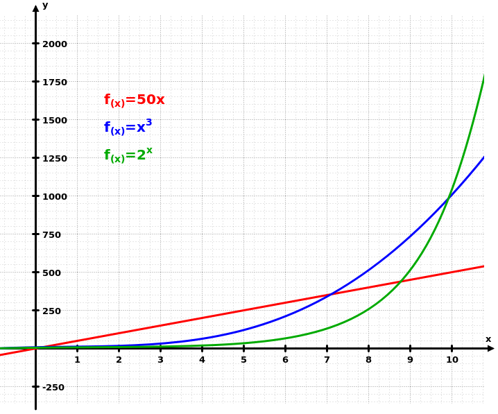

As an engineer, “You don’t scale.”

A very senior manager once told me this as career advice. The point was, to advance your career, you will need to manage people and climb the corporate ladder. You can only write so much code in a day, so your impact has an upper limit. Is this true?

In software development in particular, we think a lot about scale. We like our solutions to scale. It’s one of the holy grails of a great product. So we tend to tacitly assume that our careers must scale, too. Suggesting otherwise is like telling us our code is buggy: it’s counter to our intuition, and probably our ego. 

Somewhere in every dev’s consciousness is the mythology of the 10Xer: A great engineer can increase their team’s productivity by an order of magnitude or more. There’s exaggeration and truth in this.

Yes, even great developers can only do so much in a day. Whether you work for a startup or a big company, you’re just one piece of a larger machine that can have many bottlenecks. And typically devs are viewed as a part of operating costs. They’re a necessary evil as far as the balance sheet is concerned. They don’t create revenue; they’re just needed to help the business deliver on its commitments.

But bad development and management decisions can certainly cause a project to advance 10 times slower. In software, where complexities multiply at every turn, clarity is golden. And that comes from experience.

Today more than ever, it’s possible to have an outsized impact. For one thing, consider the power of online content. A great developer can evangelize and build community around a technology by giving talks, creating content and interacting on social media.

Also, in this age of digital transformation and heightened consumer expectations, technology architecture is becoming more enmeshed with business decisions. Retailers, construction companies and mom-and-pop shops alike must take their stack seriously just to provide an adequate experience for their customers, let alone get a competitive edge. If ["every company is a software company,"](https://news.microsoft.com/en-gb/2018/11/07/microsoft-ceo-satya-nadella-on-fuelling-tech-intensity-in-the-uk/) even the suits need to be technical.

So personally, I don’t worry about not scaling. I try to have faith that if I keep learning and building stuff, good things will happen. Software (and, uh, life?) is magical like that.