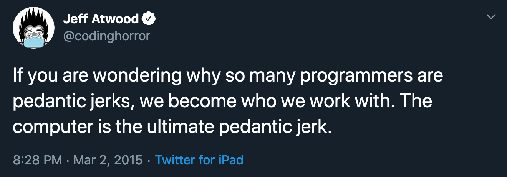

Doing challenging technical work can starve your social and creative sides because it forces you to strive for correctness all the time. You have to take deliberate steps to maintain a sense of balance, well-being and humanity.

I find joy in the abstraction, logic and ingenuity that software development entails. But the work can take a toll.

To debug effectively, you have to think like a computer and play out how a system works in your head. Do this for many hours every day, and you may begin to feel like a computer yourself.

Our work affects us more than we realize. At times, afraid I might permanently lose touch with the other parts of myself, I've considered quitting engineering entirely.

But the underlying problem of getting sucked into technical work at the expense of other parts of one's life and personality isn't a sad reality to be accepted. The issue can be avoided. I've found that the key is managing cognitive load.

Put another way, you’ve got to avoid overworking your brain’s RAM. Never let it spin too hot for too long.

Following a few guidelines makes a huge difference. For one, you can give your intellect a rest by walking or exercising. Anything physical is going to make your mind work less.

Slightly less obvious: creative and analytical tasks use different mental muscles. Take advantage of this distinction by taking creative breaks to rest your analytical chops.

Seek out conversations about something other than that problem you’re solving. A simple chat can be a fun way of remembering that not everything needs to fit into a perfectly logical box.

I like listening to podcasts in a language I’m learning to get some extra low-effort exposure. This isn’t for everyone, but for me it's a fun way of switching things up during the day. Things like this can can keep you sane and balanced. Know what they are for you, and consider setting goals for them so the time you spend doesn’t feel wasted.

Finally, use a system of notes to record your thoughts and ideas in digital or paper form. Make lists and draw pictures, and revisit them often. By writing down what you’ve already figured out, you give your mind more space. This keeps it from getting bogged down.

It is possible to do technical work without feeling like it's turning you into a robot. Coding doesn't have to be antithetical to being social. You can embrace being a nerd, be successful in your career and still be a real human being in the rest of your life. It just requires self-awareness and being disciplined with your time.