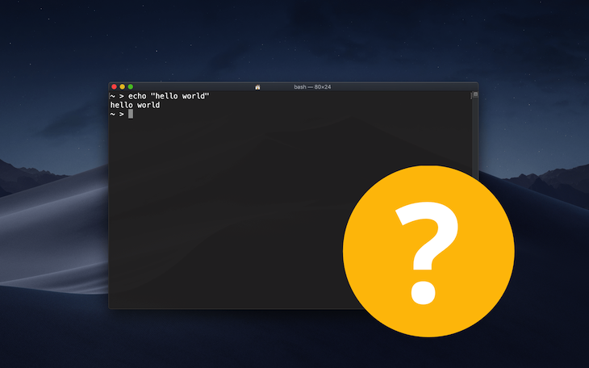

At some point early in their career, every software developer is faced with a question.

Should I learn to use a command line terminal?

Is it a time-saver or just a waste of time?

In 2019, surely we’re past such a crude tool!

There’s no objective answer. But here are a few thoughts.

One reason terminals get a bad rap in some circles is that they have high learning curve. You have to figure out the basics of how to use them in the first place. And unlike a GUI app, which tells you what it can do with buttons and menus, it’s rarely obvious how exactly to use an individual program or utility. Instead of WYSYWIG - what you see is what you get - you may encounter the prickly advice to RTFM - read the f***ing manual! Realistically, you’re more likely to read a bit of the man page and scan for the feature you need, then try it out. But the whole process, and really everything about the terminal, requires a bit of curiosity and initiative.

But in return, you get a set of interoperable tools that can be really powerful. You can script repeated tasks and tie them together in interesting ways. You even develop muscle memory for tools that are especially useful to you, making them just as quick as any GUI.

Some things suck. Text editing comes to mind, especially in comparison with modern IDEs. I once had a teacher with a perfectly configured Emacs environment. He could zip around different files and parts of code with a few keystrokes faster than you could keep up. For years I casually chased after this level of mastery with Vim. But frankly, without digressing too far, it is a pain to keep up with all the plugins and idiosyncrasies. You should still learn Vim and/or Emacs. But most of the time, stick to modern, flexible editors like VS Code and the like so you can focus on your actual work.

On the other hand, some tools are designed for the terminal and work better there. Git, for example, has some quirks as a CLI but you get used to it. GUIs, though fine for basic Git tasks, feel kludgy for more in-depth commands. The GUI is just a thin abstraction, so you end up needing to know what the commands are doing, anyway. And since version control is expressed as diffs, it lends itself well to a workflow like this: Run a command, search through the resulting text, run another command, and so on.

Similarly, compilers essentially use text as their input and output. IDEs are great, but when things aren't working quite right, a terminal is a great way to poke around at the issue.

The `find` command is still better than any built-in search function I know of. macOS Finder stinks: The default behavior is to search your whole Mac, even if you’ve selected a certain directory. And the Windows Explorer search function, while having some advanced features, is known to be downright faulty (search for windows explorer search not working).

Compared with their GUI counterparts, command line utilities also tend to be more transparent. You can see what your commands are doing and configure the output to be more or less verbose. And you can take that output and do something else with it on the fly, connecting it as the input to another command.

If you want to use Linux, modern flavors include a pretty nice GUI. But realistically, everything in Linux is built with the expectation that you can use a terminal. You won’t be able to avoid it.

Time to address the elephant in the room. I suspect some people avoid using terminals because it’s a bit too nerdy for them. But if you’re a software developer, let’s be honest, you’re nerdy enough to use a terminal. You have a certain obligation to understand things at a slightly deeper level than what's strictly required to get the job done. Web developers need to know something about browsers, and backend developers should have an idea of how databases are architected. So it’s important to be curious enough to explore things, even if they’re not perfectly user-friendly.

If you build software, you will make your life easier by learning how to use terminals. That doesn’t mean they have to be a constant part of your workflow. But if you put in bits of time here and there to experiment and learn, it'll gradually feel more comfortable. And when you *need* to set up a Docker build script or diagnose an ailing VM, you’ll have the confidence to use what you know and figure out the rest. Heck, you might even start to enjoy it!