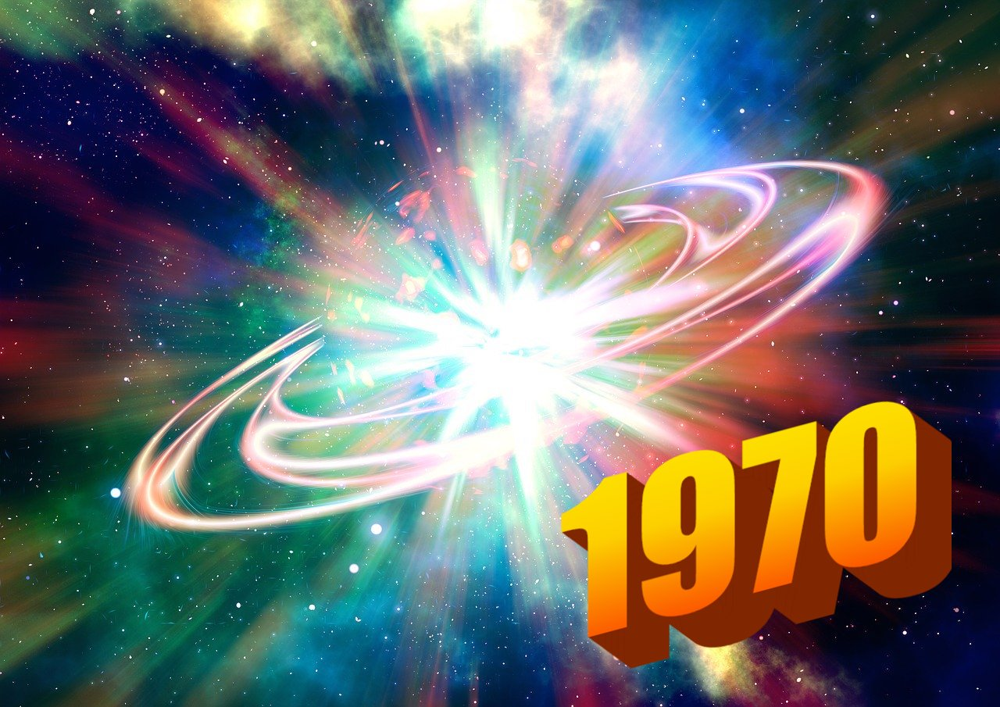

Seconds since 1970, January 1st at midnight: The Unix Epoch.

This way of representing time, called Unix or epoch time, is common in software because it makes it easy to get dates and times right.

What makes it useful? I don’t know about you, but for me, a big integer isn't a great way of talking about time. For example, August 17th at 05:27:49 AM Eastern Time seems a lot more intuitive than -485188331, which is the Unix time version. But more familiar formats also have a lot of problems that Unix time avoids.

For one thing, there's no confusion over time zones! It’s based on UTC, period. This means just a bit less mental overhead for system builders. Unix timestamps unambiguously refer to the same moment in time, wherever your code happens to run.

And working with it is simple. How many seconds are between two timestamps? With Unix time, you just subtract. No separate data structure needed to represent a duration. Want to convert seconds to hours? Just multiply by the number of seconds in an hour, or 3600. Milliseconds or smaller fractional seconds are decimals.

With modulo division, you can even check the number of hours since midnight of the current day, the number of minutes since the top of the hour and so on. And the simple representation makes it easy to write tests with canned data.

Simply put, it’s easier to build and reason about systems based on Unix time than with more human-intelligible formats, which have to be converted to a data structure and are liable to misinterpretation.

But why is it based on the start of 1970? Apparently the standard was invented in the early ‘70s, and it seemed like a reasonable thing to do. Fair enough, ‘70s computer science pioneers.

In software, Unix time is ubiquitous. Most libraries have a way of converting it to a human-readable timestamp and vice versa. The characteristically descriptive Swift programming language provides a timeIntervalSince1970 API. JavaScript returns the same value in milliseconds (in other words, multiplied by 1000) when you call getTime() on Date objects.

One downside of Unix timestamps is that they are less human-readable, which you have to account for while debugging. You can work around this with utility functions for printing human-readable timestamps. You can also convert between Unix time and other formats with tools like [epochconverter.com](http://epochconverter.com/).

Of course, if the first second in 1970 has a Unix time of 0, that makes everything pre-1970 a negative number that gets more negative as you go back in time. You’ll want to take the absolute value to do modulo division. Other basic operations work fine with negatives.

Now, because nothing in internationalization is as simple as we’d like, there is a rub. Leap seconds, or extra seconds that are prescribed by scientists from time to time, are accounted for in Unix time by double-counting. Those extra leap seconds actually have the same value as the second before them. This makes Unix time not a true representation of UTC!

International atomic time (TAI) is an equivalent system which includes leap seconds as separate timestamps. This means it gradually gets out of sync with earth’s rotation by roughly a second per year. But in return, it avoids duplicating values. In my experience, ordinary Unix time is the standard, but TAI may gain popularity, especially in domains like time-critical domains finance and aerospace engineering.

Use Unix time to represent time in your apps! It’ll make your code easier to understand and less error-prone, so you can focus on other stuff.